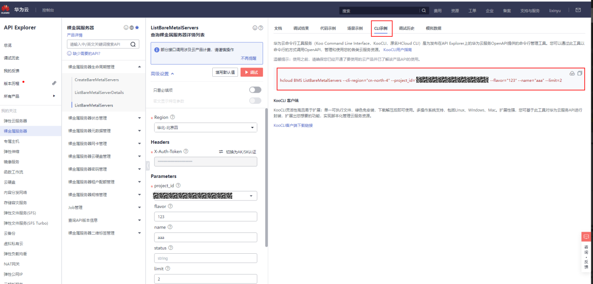

# huaweicloud-cli-workflow-samples
本READEME是基于[HuaweiCloud Cli Action](https://github.com/marketplace/actions/huaweicloud-cli-action)使用华为云KooCLI的workflows样例。  
[华为云命令行工具服务（Koo Command Line Interface，KooCLI，原名HCloud CLI）](https://support.huaweicloud.com/productdesc-hcli/hcli_01.html)，是为发布在API Explorer上的华为云服务API提供的命令行管理工具。您可以通过此工具调用API Explorer中各云服务开放的API，管理和使用您的各类云服务资源。
您可以通过配置KooCLI-action参数，快捷使用KooCLI。  

## **前置工作**
(1).action调用华为云接口需要华为云鉴权，建议将您华为云账户的ak/sk配置于您GitHub工程中的settting-Secret-Actions，分别添加为ACCESSKEY、SECRETACCESSKEY以加密使用，[获取ak/sk方式](https://support.huaweicloud.com/api-obs/obs_04_0116.html)；
(2). 获取云服务API调用命令。
> 获取云服务API调用命令有两种方式：  
1.（推荐）[API Explorer](https://apiexplorer.developer.huaweicloud.com/apiexplorer/overview)上获取：云服务的API可在API Explorer上查看。您可以在API Explorer对应的API调试中，填写各参数的值，然后从“CLI示例”页签中直接获取命令。

2.KooCLI帮助信息查询：具体查询方法可参考查看与[执行云服务操作命令](https://support.huaweicloud.com/qs-hcli/hcli_02_005.html)，Mac和Linux系统下查询方法类似。

## **参数说明:**
|  参数名称  |  参数说明  |  默认值  |  是否必填  |
|  :----:  |  ----  |  :----: |  :----:  |
| access_key  | 访问密钥ID。与私有访问密钥关联的唯一标识符，和私有访问密钥(secret_key)一起使用，对请求进行加密签名。建议参照**前置工作**中的步骤2进行设置以加密使用。 |  无  |  是  |
| secret_key  | 与访问密钥ID(access_key)结合使用的私有访问密钥，对请求进行加密签名，可标识发送方，并防止请求被修改。建议参照**前置工作**中的步骤2进行设置以加密使用。 |  无  |  是  |
| region  | 默认区域，如cn-north-4。 |  cn-north-4  |  否  |
| command_list | KooCLI的操作指令，可以添加多条指令，会依次执行。 | 无 | 是 |
> 关于参数'region'：在没有添加参数'--cli-region'的操作指令中，会使用这个默认region。具体region参数的使用，请参考您要使用的服务允许的[地区和终端节点](https://developer.huaweicloud.com/endpoint)

## **使用样例:**
###1、基本使用
**弹性云服务器（ECS）**，查询*华北-北京四*API版本信息列表（API：NovaListVersions）
```yaml
jobs:
  List-Versions:
    runs-on: ubuntu-latest
    steps:
      uses: huaweicloud/huaweicloud-cli-action@v1.0.0
      with:
        access_key: ${{ secrets.ACCESSKEY }}
        secret_key: ${{ secrets.SECRETACCESSKEY }}
        region: 'cn-north-4'
        commandList: 'hcloud ECS NovaListVersions'
```
详见[ECS-list-versions.yml](./.github/workflows/ECS-list-versions.yml)  
###2、多条命令，设置参数
**弹性云服务器（ECS）**，批量添加云服务器标签（API：BatchCreateServerTags）后，查询云服务器标签（API：ShowServerTags）
```yaml
jobs:
  Create-Show-Tags:
    runs-on: ubuntu-latest
    steps:
      - name: Create and Show Tags of ECS By KooCLI
        uses: huaweicloud/huaweicloud-cli-action@v1.0.0
        with:
          access_key: ${{ secrets.ACCESSKEY }}
          secret_key: ${{ secrets.SECRETACCESSKEY }}
          region: 'cn-north-4'
          commandList: |
            hcloud ECS BatchCreateServerTags --cli-region="cn-east-3" --project_id="0*******************b" --server_id="123" --action="create" --tags.1.value="value" --tags.1.key="key"
            hcloud ECS ShowServerTags --cli-region="cn-east-3" --project_id="0*******************b" --server_id="123"
```
详见[ECS-create-show-tags.yml](./.github/workflows/ECS-create-show-tags.yml)  