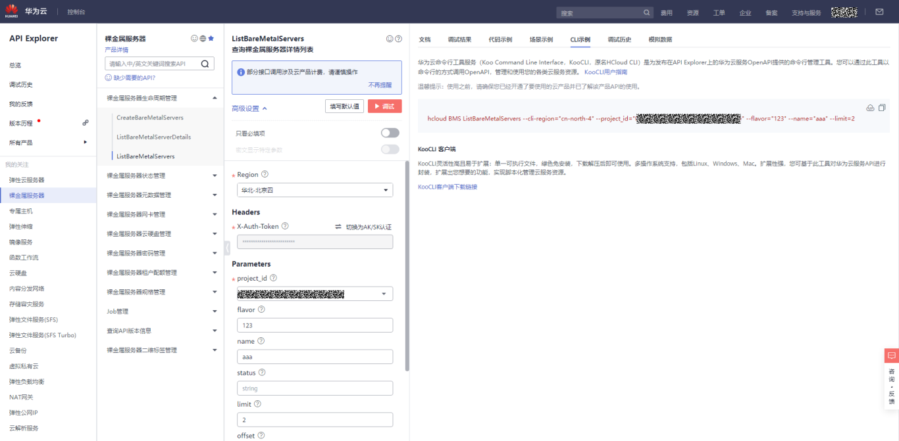

# Huawei-Cloud-KooCLI-workflow-samples
本READEME是基于使用Action：[Huawei Cloud KooCLI](https://github.com/huaweicloud/huaweicloud-cli-action)，在workflows中安装并使用华为云KooCLI的样例。  
[华为云命令行工具服务（Koo Command Line Interface，KooCLI，原名HCloud CLI）](https://support.huaweicloud.com/productdesc-hcli/hcli_01.html)，是为发布在API Explorer上的华为云服务API提供的命令行管理工具。您可以通过此工具调用API Explorer中各云服务开放的API，管理和使用您的各类云服务资源。  
您可以通过配置action参数，安装并配置KooCLI，以便在其他action或者step使用KooCLI。目前action支持在Windows、Linux AMD 64位 、Linux ARM 64位、MacOS AMD 64位 和 MacOS ARM 64位操作系统上安装使用。

## **前置工作**
1.action调用华为云接口需要华为云鉴权，建议将您华为云账户的ak/sk配置于您GitHub工程中的settting-Secret-Actions，分别添加为ACCESSKEY、SECRETACCESSKEY以加密使用，[获取ak/sk方式](https://support.huaweicloud.com/api-obs/obs_04_0116.html)；
2.获取云服务API调用命令。
> 获取云服务API调用命令有两种方式：  
1.（推荐）[API Explorer](https://apiexplorer.developer.huaweicloud.com/apiexplorer/overview)上获取：云服务的API可在API Explorer上查看。您可以在API Explorer对应的API调试中，填写各参数的值，然后在“CLI示例”页签中直接获取命令。

2.KooCLI帮助信息查询：具体查询方法可参考查看与[执行云服务操作命令](https://support.huaweicloud.com/qs-hcli/hcli_02_005.html)，Mac和Linux系统下查询方法类似。

## **华为云统一鉴权认证**
推荐使用[huaweicloud/auth-action](https://github.com/huaweicloud/auth-action)进行OBS操作的鉴权认证。
```yaml
- name: Authenticate to Huawei Cloud
  uses: huaweicloud/auth-action@v1.0.0
  with: 
      access_key_id: ${{ secrets.ACCESSKEY }} 
      secret_access_key: ${{ secrets.SECRETACCESSKEY }}
      region: '<region>'
```

## **参数说明:**
|  参数名称  |  参数说明  |  默认值  |  是否必填  |
|  :----:  |  ----  |  :----: |  :----:  |
| access_key  | 访问密钥ID。与私有访问密钥关联的唯一标识符，和私有访问密钥(secret_key)一起使用，对请求进行加密签名。建议参照**前置工作**中的步骤2进行设置以加密使用。 |  无  |  是  |
| secret_key  | 与访问密钥ID(access_key)结合使用的私有访问密钥，对请求进行加密签名，可标识发送方，并防止请求被修改。建议参照**前置工作**中的步骤2进行设置以加密使用。 |  无  |  是  |
| region  | 默认区域，如cn-north-4。 |  cn-north-4  |  否  |
| command_list | KooCLI的操作指令，可以添加多条指令，会依次执行。 | 无 | 否 |
> 关于参数'region'：在没有添加参数'--cli-region'的操作指令中，会使用这个默认region。具体region参数的使用，请参考您要使用的服务允许的[地区和终端节点](https://developer.huaweicloud.com/endpoint)

## **使用样例:**
以下action示例片段均使用了华为云统一鉴权[huaweicloud/auth-action](https://github.com/huaweicloud/auth-action)。 
### 1、基本使用
安装成功后，查询**弹性云服务器（ECS）** *华北-北京四* API版本信息列表（NovaListVersions）
```yaml
jobs:
  List-Versions:
    runs-on: windows-latest
    steps:
    - name: Authenticate to Huawei Cloud
      uses: huaweicloud/auth-action@v1.0.0
      with: 
          access_key_id: ${{ secrets.ACCESSKEY }} 
          secret_access_key: ${{ secrets.SECRETACCESSKEY }}
          region: '<region>'

      - name: Install KooCLI and List Versions Of ECS
        uses: huaweicloud/huaweicloud-cli-action@v1.0.0
        with:
          command_list: 'hcloud ECS NovaListVersions'
```
详见[ECS-list-versions.yml](./.github/workflows/ECS-list-versions.yml)  
### 2、多条命令
安装成功后，在**弹性云服务器（ECS）** 上批量添加云服务器标签（BatchCreateServerTags）后，查询云服务器标签（ShowServerTags）
```yaml
jobs:
  Create-Show-Tags:
    runs-on: macos-latest
    steps:
      - name: Authenticate to Huawei Cloud
        uses: huaweicloud/auth-action@v1.0.0
        with: 
          access_key_id: ${{ secrets.ACCESSKEY }} 
          secret_access_key: ${{ secrets.SECRETACCESSKEY }}
          region: '<region>'

      - name: Create and Show Tags of ECS by KooCLI
        uses: huaweicloud/huaweicloud-cli-action@v1.0.0
        with:
          command_list: |
            hcloud ECS BatchCreateServerTags --cli-region="cn-north-4" --project_id="0*******************b" --server_id="123" --action="create" --tags.1.value="value" --tags.1.key="key"
            hcloud ECS ShowServerTags --cli-region="cn-north-4" --project_id="0*******************b" --server_id="123"
```
详见[ECS-create-show-tags.yml](./.github/workflows/ECS-create-show-tags.yml)  
### 3、安装成功后，在其他位置使用KooCLI
成功安装KooCLI，在进行其他操作后，使用**代码检查（CodeCheck）** 服务，新建检查任务（CreateTask），并根据任务ID，执行代码检查任务（RunTask）并查询缺陷概要（ShowTaskDetail）
```yaml
jobs:
  Setup-KooCLI-And-Run-Codecheck:
    runs-on: ubuntu-latest
    steps:
      # 代码检出
      - name: checkout
        uses: actions/checkout@v2

      # 统一鉴权
      - name: Authenticate to Huawei Cloud
        uses: huaweicloud/auth-action@v1.0.0
        with: 
          access_key_id: ${{ secrets.ACCESSKEY }} 
          secret_access_key: ${{ secrets.SECRETACCESSKEY }}
          region: '<region>'

      # 安装KooCLI
      - name: Set up KooCLI
        uses: huaweicloud/huaweicloud-cli-action@v1.0.0

      # 查询KooCLI配置项
      - run: hcloud configure list
          
      # 调用KooCLI，执行代码检查
      - name: Run CodeCheck Task by KooCLI
        run: |
          hcloud CodeCheck CreateTask --cli-region="cn-north-4" --project_id="your_project_id" --rule_sets.1.language="rule_language" --git_branch="your_branch" --language.1="your_language" --git_url="your_repository_url"
          hcloud CodeCheck RunTask --cli-region="cn-north-4" --task_id="your_codecheck_task_id"
          hcloud CodeCheck ShowTaskDetail --cli-region="cn-north-4" --task_id="your_codecheck_task_id"
```
详见[setup-KooCLI-run-codecheck.yml](./.github/workflows/setup-KooCLI-run-codecheck.yml) 